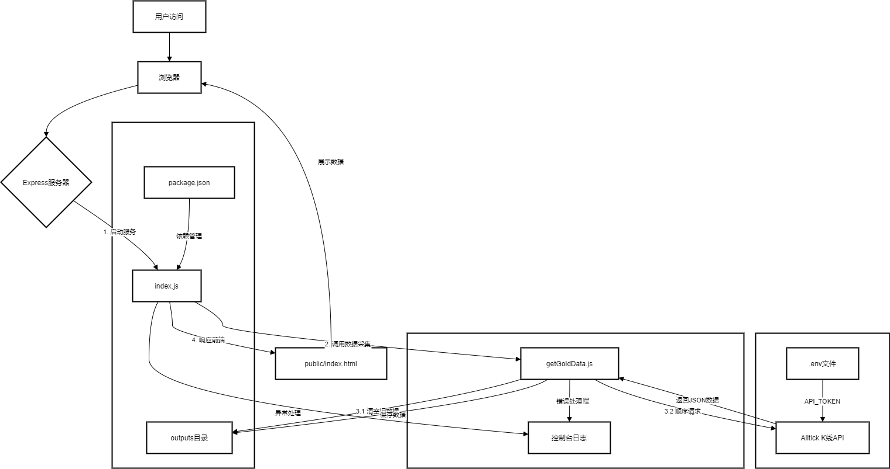

# 🏅 黄金价格数据采集系统

基于 Node.js 的高效黄金市场数据采集解决方案，支持多时间维度数据采集与可视化展示



## ✨ 核心功能

- **多维度数据采集**  
  分钟/小时/日/周/月 K 线数据全覆盖
- **智能存储系统**  
  结构化 JSON 存储，完美适配 AI 分析预测
- **可视化展示**  
  内置 K 线图展示页面，数据洞察更直观
- **弹性配置**  
  支持 API Token 动态配置

## 🚀 快速开始

### 环境要求

- Node.js
- npm

### 安装指南

```bash
git clone git@github.com:coderxiao24/goldPrice.git
cd goldPrice/
npm install
```

### 配置说明

`.env` 文件中：

```
API_TOKEN=your_token_here # 前往 https://alltick.co/register 申请
```

### 启动服务

```bash
npm start
# 服务启动后会自动打开可视化界面
```

## 📂 数据结构规范

### 存储路径

```
outputs/
├── 分钟K数据.json
├── 小时K数据.json
├── 日K数据.json
├── 周K数据.json
└── 月K数据.json
```

### 数据结构

| 字段           | 类型    | 必填 | 说明                   |
| -------------- | ------- | ---- | ---------------------- |
| ret            | integer | ✔️   | 返回码                 |
| msg            | string  | ✔️   | 状态信息               |
| trace          | string  | ✔️   | 请求追踪 ID            |
| data           | object  | ✔️   | 核心数据               |
| » code         | string  | ✔️   | 资产代码 (例: XAUUSD)  |
| » kline_type   | integer | ✔️   | K 线类型代码 (1-10)    |
| » kline_list   | array   | ✔️   | K 线数据集合           |
| »» timestamp   | string  | ✔️   | 精确到秒的时间戳 (UTC) |
| »» open_price  | string  | ✔️   | 开盘价                 |
| »» close_price | string  | ✔️   | 收盘价                 |
| »» high_price  | string  | ✔️   | 最高价                 |
| »» low_price   | string  | ✔️   | 最低价                 |
| »» volume      | string  | ✔️   | 成交量                 |
| »» turnover    | string  | ✔️   | 成交额                 |

## ⚙️ API 配置指南

### 时间类型对照表

| kline_type | 时间维度    | 备注         |
| ---------- | ----------- | ------------ |
| 1          | 1 分钟 K 线 | 基础时间单位 |
| 5          | 1 小时 K 线 |              |
| 8          | 日 K 线     |              |
| 9          | 周 K 线     |              |
| 10         | 月 K 线     |              |

### 频率限制策略

| 服务等级 | 请求频率 | 每日上限  | 特殊说明                 |
| -------- | -------- | --------- | ------------------------ |
| 免费版   | 10 秒/次 | 14,400 次 | batch-kline 需间隔 10 秒 |
| 基础版   | 1 秒/次  | 86,400 次 | batch-kline 需间隔 3 秒  |
| 专业版   | 20 次/秒 | 1,728,000 | 支持高频实时采集         |

## ❓ 常见问题

### 采集间隔设置

**为什么默认采集间隔为 11 秒？**
为符合免费版 API 的频率限制（10 秒/次），预留 1 秒安全缓冲

### 数据量限制

**为什么最多只能获取 1000 条数据？**
受 API 服务商接口限制，可通过以下方案扩展：

1. 定期归档历史数据
2. 升级 API 服务等级
3. 实现数据分页采集功能

### 性能优化建议

- 使用 PM2 进行进程管理
- 启用数据压缩存储
- 实现增量采集模式

**📌 重要提示**
当前默认使用免费版 API Token，若出现以下情况请及时更换：
⚠️ 频繁出现 4xx 状态码
⚠️ 日采集量超过 14,400 次
⚠️ 需要更高精度的时间颗粒度

[立即申请专属 API Token →](https://alltick.co/register)

> 项目持续维护中，欢迎提交 Issue 和 PR
> 📧 技术支持：xiaokaixuan24@163.com
> 🔗 项目主页：https://github.com/coderxiao24/goldPrice
